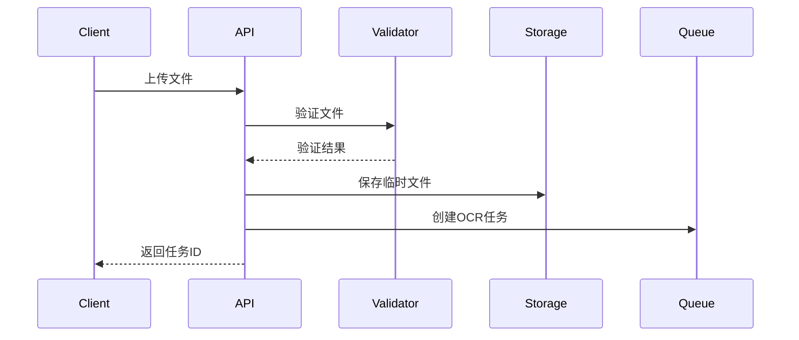
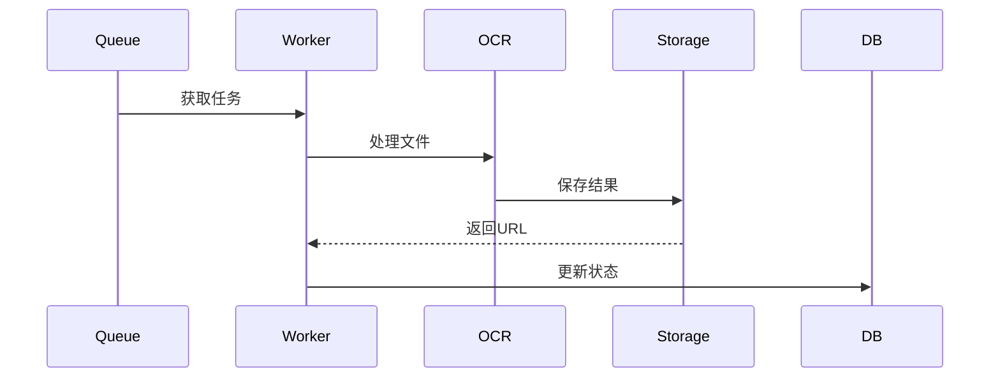

# Py OCR 服务设计文档

## 1. 系统架构

### 1.1 整体架构

```
+-------------+     +-------------+     +--------------+
|             |     |             |     |              |
| Client/用户  +---->+ Flask API   +---->+ Celery Queue |
|             |     |             |     |              |
+-------------+     +-------------+     +--------------+
                          |                    |
                          v                    v
                   +-----------+        +-------------+
                   |           |        |             |
                   | SQLite DB |        | OCR Worker  |
                   |           |        |             |
                   +-----------+        +-------------+
                                             |
                                             v
                                    +----------------+
                                    |                |
                                    | MinIO Storage  |
                                    |                |
                                    +----------------+
```

### 1.2 核心组件

- **Flask API**: 提供 RESTful API 接口
- **Celery Queue**: 异步任务队列
- **SQLite DB**: 存储任务状态和结果
- **OCR Worker**: 处理 OCR 识别任务
- **MinIO Storage**: 对象存储服务

### 1.3 技术栈选型理由

- **Flask**: 轻量级、灵活、易于扩展
- **Celery**: 分布式任务队列，支持异步处理和任务重试
- **SQLite**: 无需额外服务器，适合中小规模应用
- **MinIO**: 兼容 S3 协议，支持分布式部署
- **Tesseract**: 开源 OCR 引擎，支持多语言

## 2. 项目结构

### 2.1 目录结构

```
py-ocr/
├── app/                    # 应用主目录
│   ├── api/               # API接口层
│   │   ├── __init__.py
│   │   └── routes.py     # API路由定义
│   ├── config/           # 配置层
│   │   ├── __init__.py
│   │   ├── config.py    # 配置类
│   │   └── logging_config.py  # 日志配置
│   ├── models/           # 数据模型层
│   │   ├── __init__.py
│   │   └── task.py      # 任务模型
│   ├── services/         # 服务层
│   │   ├── __init__.py
│   │   ├── minio_service.py  # MinIO服务
│   │   └── ocr_service.py    # OCR服务
│   ├── tasks/            # 任务层
│   │   ├── __init__.py
│   │   └── ocr_task.py  # Celery任务
│   └── utils/           # 工具层
│       └── __init__.py
├── tests/               # 测试目录
├── docs/               # 文档目录
└── deployment/         # 部署配置
```

### 2.2 分层设计

1. **表现层 (API 层)**

   - 处理 HTTP 请求和响应
   - 参数验证和错误处理
   - 路由管理

2. **业务层 (Service 层)**

   - 实现核心业务逻辑
   - 组合调用各种服务
   - 事务管理

3. **数据层 (Model 层)**

   - 数据结构定义
   - 数据访问接口
   - 数据验证逻辑

4. **任务层 (Task 层)**
   - 异步任务定义
   - 任务状态管理
   - 重试策略

## 3. 设计原则

### 3.1 SOLID 原则应用

1. **单一职责原则 (SRP)**

   - OCRService 专注于文本识别
   - MinioService 专注于文件存储
   - TaskService 专注于任务管理

2. **开放封闭原则 (OCP)**

   - 服务接口抽象化
   - 配置外部化
   - 插件化设计

3. **里氏替换原则 (LSP)**

   - 文件处理接口统一
   - 存储服务接口统一
   - 任务处理接口统一

4. **接口隔离原则 (ISP)**

   - 最小化服务接口
   - 职责明确的 API
   - 解耦的组件设计

5. **依赖倒置原则 (DIP)**
   - 依赖抽象而非实现
   - 通过配置注入依赖
   - 使用工厂模式创建实例

### 3.2 设计模式应用

1. **创建型模式**

   - 单例模式: 配置管理、数据库连接
   - 工厂模式: 服务创建、任务创建
   - 建造者模式: 复杂对象构建

2. **结构型模式**

   - 适配器模式: 统一接口适配
   - 装饰器模式: 功能增强
   - 代理模式: 访问控制

3. **行为型模式**
   - 策略模式: 文件处理策略
   - 观察者模式: 任务状态通知
   - 命令模式: 任务执行

## 4. 关键流程

### 4.1 文件上传流程



### 4.2 OCR 处理流程



## 5. 安全设计

### 5.1 系统安全

- 输入验证
- CORS 配置
- 请求限流
- 文件大小限制

### 5.2 数据安全

- 文件名加密
- 临时文件清理
- MinIO 访问控制
- 数据备份策略

## 6. 性能优化

### 6.1 系统优化

- 异步处理
- 任务队列
- 连接池
- 缓存策略

### 6.2 OCR 优化

- 图像预处理
- 并行处理
- 结果缓存
- 批量处理

## 7. 可用性设计

### 7.1 高可用方案

- 服务冗余
- 负载均衡
- 故障转移
- 数据备份

### 7.2 监控告警

- 系统监控
- 性能监控
- 错误告警
- 日志分析

## 8. 扩展性设计

### 8.1 水平扩展

- 多 Worker 部署
- 分布式存储
- 负载均衡
- 数据分片

### 8.2 垂直扩展

- 资源配置优化
- 代码优化
- 算法优化
- 缓存优化

## 9. 部署方案

### 9.1 Docker 部署

```yaml
version: "3"
services:
  web:
    build: .
    ports:
      - "5000:5000"
  worker:
    build: .
    command: celery worker
  redis:
    image: redis:latest
  minio:
    image: minio/minio
```

### 9.2 Kubernetes 部署

- 资源配置
- 服务编排
- 自动扩缩容

## 10. 开发规范

### 10.1 代码规范

- 遵循 PEP 8
- 类型注解
- 文档字符串
- 单元测试

### 10.2 Git 规范

- 分支管理
- 提交信息
- 代码审查
- 版本发布

## 11. 测试策略

### 11.1 单元测试

- 服务层测试
- 模型层测试
- 工具函数测试
- 边界条件测试

### 11.2 集成测试

- API 测试
- 任务处理测试
- 存储服务测试
- 性能测试

### 11.3 端到端测试

- 完整流程测试
- 异常场景测试
- 压力测试
- 兼容性测试

## 12. 监控和运维

### 12.1 监控指标

- 请求量
- 响应时间
- 错误率
- 资源使用率

### 12.2 日志管理

- 访问日志
- 错误日志
- 性能日志
- 审计日志

### 12.3 告警策略

- 错误率告警
- 性能告警
- 资源告警
- 安全告警

## 13. 版本规划

### 13.1 v1.0.0

- 基础功能实现
- 核心 API 完成
- 基本测试覆盖

### 13.2 v1.1.0

- 批量处理优化
- 更多文件格式支持
- 性能优化

### 13.3 v1.2.0

- 认证授权
- 高级 OCR 功能
- 分布式部署支持

## 14. 风险评估

### 14.1 技术风险

- OCR 准确率
- 系统性能
- 数据安全
- 服务可用性

### 14.2 业务风险

- 用户需求变化
- 市场竞争
- 成本控制
- 合规要求

## 15. 维护计划

### 15.1 日常维护

- 日志清理
- 数据备份
- 性能监控
- 安全更新

### 15.2 定期优化

- 代码重构
- 性能调优
- 功能增强
- 文档更新
